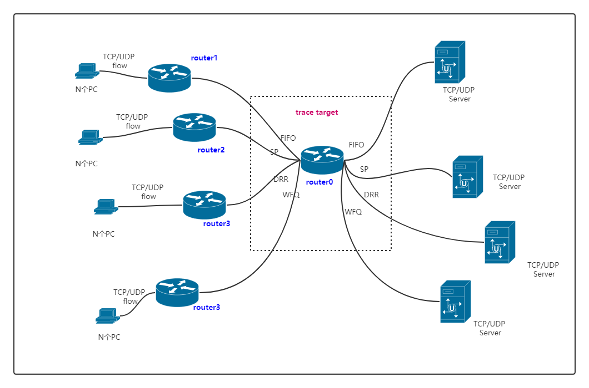

### 1. Network topology

拓扑图中**router0**有8个端口, 每个端口应用不同的调度算法. **router1~router4**分别连接多个TCP/UDP客户端.

### 2. Setup

1. 客户端发送速率固定为: 1 Mb/s, 数据包大小固定为：800 B;

2. 实验设置了多条不同的UDP/TCP flow (100+), 每条flow的持续时间从1秒-20秒不等;

3. 根据5元组的不同, 不同的flow会被随机分到不同的优先级队列中;

4. FIFO: 队列可容纳的数据包数量MaxPacket=10000 packets;

5. SP: 设置8个队列 0-7, 其中队列 0 优先级最高, 队列 7 优先级最低;

6. DRR: 设置 8 个队列 0-7, quantum = 800;

7. WFQ: 设置 8 个队列, 在DRR的基础上进行简单修改, 即根据不同的权重设置不同的quantum值. 实验中队列 0-7 的权重分别为1：2：3：4：5：6：7：8, 相应的队列 0-7的quantum设为 1 * 800, 2 * 800, 3 * 800, 4 * 800, 5 * 800, 6 * 800, 7 * 800, 8 * 800;

8. 字段：

共 13 个字段:

1)`FlowId:`流ID, 根据5元组划分;

2)`PacketUid:`该flow的第n个数据包;

3)`Protocol:`协议号;

4)`PacketSize:`IP包大小(包含报头);

5)`IngressPort: `Ingress port;

6)`EgressPort:`Egress port;

7)`Type:`调度算法;

8)`Queue:`分到的优先级队列, FIFO恒为0;

9)`Quantum:`Quantum, WFQ根据不同的weight为每个队列设置不同的quantum值;

10)`PhyRxEndTime:`数据帧完整地被网卡接收的时间点;

11)`PhyTxEndTime:`数据包被完整地发送到数据链路的时间点;

12)`Source:`源IP;

13)`Destination:`目的IP.

**Note:** 经过一波尝试, 现在的情况可能无法直接在交换机(bridge/openflow)的端口上直接应用不同的调度算法, 所以只在router上进行实验.

