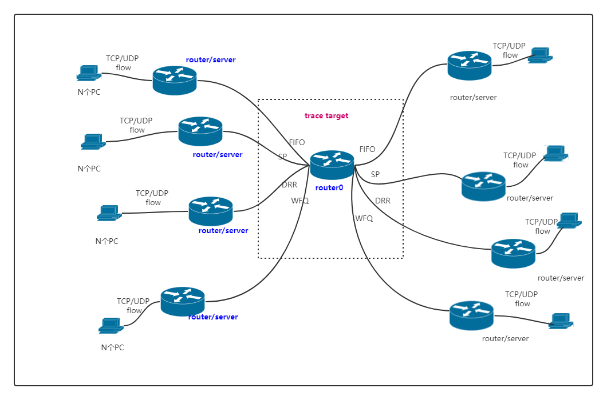

### 1. Network topology

拓扑图中**router0**有8个端口, 每个端口应用不同的调度算法.

### 2. Setup

1. 客户端发送速率固定为: 1 Mb/s, 数据包大小固定为：1400 B;

2. 实验设置了多条不同的UDP/TCP flow (100+), 每条flow的持续时间从1秒-10秒不等;

3. 根据5元组的不同, 不同的flow会被随机分到不同的优先级队列中;

4. FIFO: 队列可容纳的数据包数量MaxPacket=10000 packets;

5. SP: 设置8个队列 0-7, 其中队列 0 优先级最高, 队列 7 优先级最低;

6. DRR: 设置 8 个队列 0-7, quantum 在 [128, 4096]范围内随机选择, 每1200ms变一次, 大概有10K个time unit;

7. WFQ: 设置 8 个队列, 在DRR的基础上进行简单修改, 即根据不同的权重设置不同的quantum值. 各个队列的quantum在 [128, 4096]范围内随机选择, 每1200ms变一次, 大概有10K个time unit;

8. 字段：

1)`FlowId:`流ID, 根据5元组划分;

2)`PacketUid:`该flow的第n个数据包;

3)`Protocol:`协议号;

4)`PacketSize:`IP包大小(包含报头);

5)`IngressPort: `Ingress port;

6)`EgressPort:`Egress port;

7)`Type:`调度算法;

8)`Queue:`分到的优先级队列, FIFO恒为0;

9)`Quantum:`Quantum, WFQ根据不同的weight为每个队列设置不同的quantum值;

10)`PhyRxEndTime:`数据帧完整地被网卡接收的时间点 (us);

11)`PhyTxEndTime:`数据包被完整地发送到数据链路的时间点 (us);

12)`Source:`源IP;

13)`Destination:`目的IP.

14)`LinkRate:`链路速率; (note: 实验中统一为20Mbps)

15)`Delay:`链路时延; (note: 实验中统一为2ms)

16)`w1-w8:`WFQ权重; (note: DRR权重全置为1, FIFO和SP全置为-1)

17)`f11-f88:`转发矩阵

